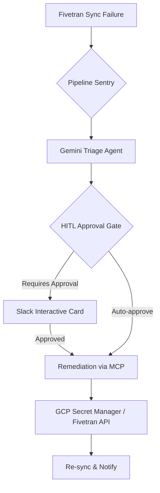

# Pipeline Sentry 🛡️

**A Self-Healing First Responder Agent for Data Pipelines.** 
*Built for the Google Cloud Agent Builder Hackathon.*

## 🚨 The Problem
Data engineers suffer from alert fatigue. When a pipeline fails at 3 AM due to a trivial issue (like an expired Stripe API key in Fivetran), an engineer shouldn't have to wake up just to rotate a credential and click "retry."

## 🤖 The Solution
Pipeline Sentry acts as an autonomous First Responder. Leveraging **Google Cloud Agent Builder** and **Gemini 2.0**, it uses the **Model Context Protocol (MCP)** to interact directly with Fivetran and GCP Secret Manager.

### 🏗️ Architecture


1. **Detect:** Monitors Fivetran for sync failures via the Fivetran MCP.
2. **Diagnose:** Reads error logs to identify the root cause (e.g., Expired API Key).
3. **Self-Heal:** Uses Secret Manager to rotate credentials and updates the Fivetran connector configuration.
4. **Verify & Notify:** Triggers a re-sync and alerts the team via Slack/Google Chat once resolved.

## 📁 Repository Structure
```text
pipeline-sentry/
├── agents/          # Core Vertex AI logic & Gemini triage prompts
├── connectors/      # Wrappers for MCP tool execution & notifications
├── manifests/       # Deployment YAMLs (Agent Builder, Cloud Run)
├── mcp_configs/     # Fivetran & GCP Secret Manager MCP configs
└── tests/           # Mock validation data
```

## 🚀 Quick Start
1. Clone the repository.
2. Install dependencies: `pip install -r requirements.txt`
3. Copy `.env.example` to `.env` and add your API keys.
4. Start the Sentry: `python main.py`
